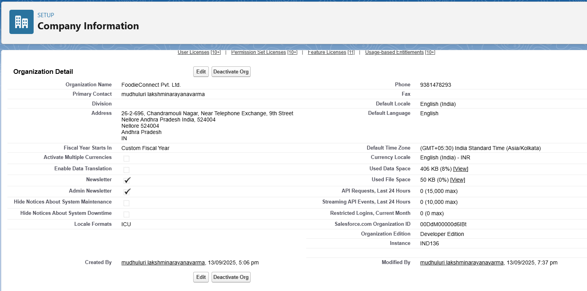
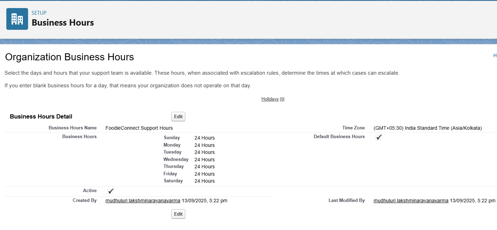
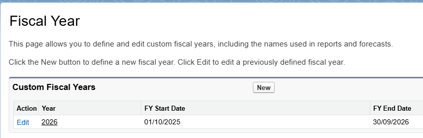
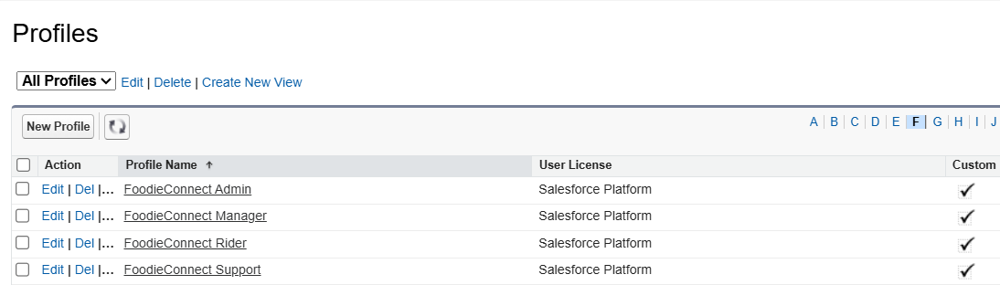
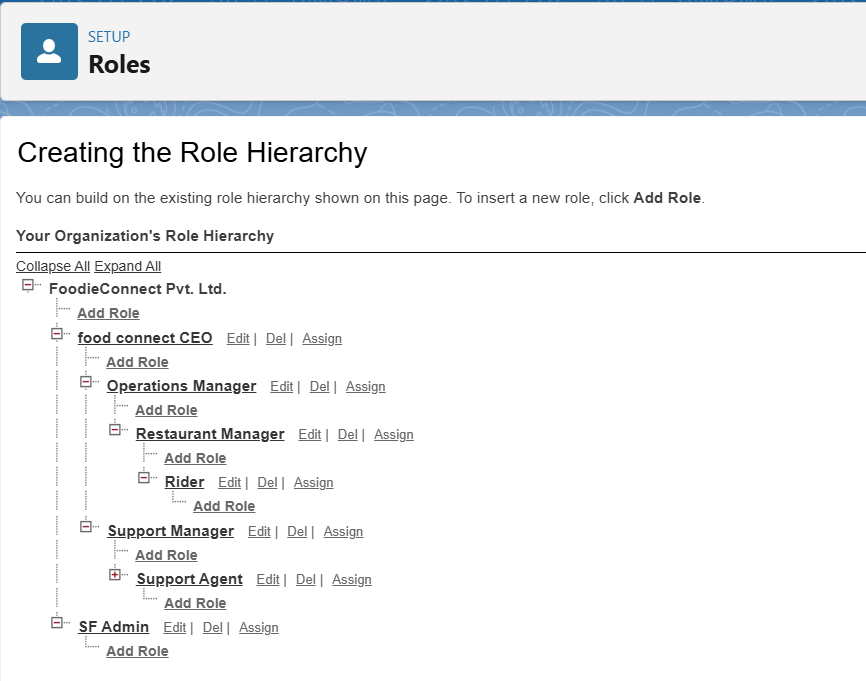
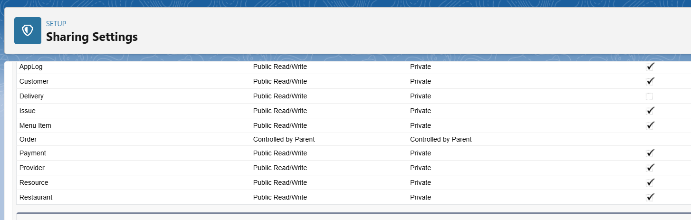

# 1. FoodieConnect Salesforce CRM – Phase 2 Setup

FoodieConnect Pvt. Ltd. is building a Salesforce-powered CRM tailored for the food delivery industry.  
This phase covers **organizational setup, user management, access control, and deployment basics** to ensure smooth operations and collaboration.  
By configuring company details, business hours, fiscal cycles, user roles, profiles, and sharing rules, the system reflects FoodieConnect’s unique operational needs.

---

## 2. Company Profile Setup

The company information has been configured to reflect FoodieConnect’s business identity and operating details.

- **Organization Name:** FoodieConnect Pvt. Ltd.  
- **Primary Contact:** Mudhuluri Lakshminarayanavarma  
- **Phone:** 9381478293  
- **Address:** 26-2-696, Chandramouli Nagar, Near Telephone Exchange, 9th Street, Nellore, Andhra Pradesh, India – 524004  
- **Default Locale:** English (India)  
- **Default Language:** English  
- **Time Zone:** India Standard Time (GMT+05:30, Asia/Kolkata)  
- **Currency Locale:** INR (English - India)  
- **Multiple Currencies:** Not enabled  

This setup ensures that all users in the organization experience Salesforce in their local context, with Indian time, currency, and language preferences.

---

## 3. Business Hours & Holidays

FoodieConnect has defined 24x7 business hours to ensure that support and operational activities are aligned with its always-available food delivery service.

- **Business Hours Name:** FoodieConnect Support Hours  
- **Schedule:** Sunday to Saturday – 24 Hours  
- **Default Business Hours:** Enabled  
- **Active:** Yes  
- **Holidays Configured:** None  

This configuration reflects the company’s commitment to continuous service without holiday restrictions.

---

## 4. Fiscal Year Settings

A Custom Fiscal Year has been activated to align financial reporting with FoodieConnect’s operational cycle.

- **Fiscal Year 2026:**  
  - **Start Date:** 01-Oct-2025  
  - **End Date:** 30-Sep-2026  

This customization ensures that accounting and business reporting follow the company’s specific financial planning needs instead of Salesforce’s standard calendar year.

---

## 5. Profiles

To control system access and tailor permissions for different user groups, the following profiles have been created under the Salesforce Platform license:

- **FoodieConnect Admin** – for system administrators with high-level access.  
- **FoodieConnect Manager** – for operational and business managers.  
- **FoodieConnect Rider** – for delivery staff with limited access to orders and tasks.  
- **FoodieConnect Support** – for customer support representatives.  

This division ensures that users only access the parts of Salesforce relevant to their responsibilities.

---

## 6. Roles

A role hierarchy has been set up to mirror FoodieConnect’s organizational structure. This supports reporting visibility and record ownership.

- **FoodieConnect Pvt. Ltd.**  
  - CEO  
    - Operations Manager  
      - Restaurant Manager  
        - Rider  
    - Support Manager  
      - Support Agent  
  - SF Admin  

This hierarchy ensures that higher roles (like CEO and Managers) have visibility into the activities of their subordinates, while also providing clear separation of responsibilities.

---

## 7. Organization-Wide Defaults (OWD)

The baseline sharing model controls record visibility across the organization.

- **Customer:** Public Read/Write  
- **Delivery:** Public Read/Write  
- **Issue:** Public Read/Write  
- **Menu Item:** Public Read/Write  
- **Order:** Controlled by Parent  
- **Payment:** Public Read/Write  
- **Provider:** Public Read/Write  
- **Resource:** Public Read/Write  
- **Restaurant:** Public Read/Write  

This setup ensures collaboration across teams while maintaining parent-controlled access for orders to ensure proper linkage with related records.

---

## 8. Sharing Rules

To provide additional record access beyond OWDs, sharing rules have been configured:

- **Orders Sharing Rule:** Managers and Admins have full access to Orders owned by Riders.  
- **Payments Sharing Rule:** Managers have full access to all Payments for financial tracking.  
- **Customer Sharing Rule:** Support Agents have read/write access to all Customer records for better assistance.  
- **Restaurant Sharing Rule:** Operations Managers and Admins have full access to Restaurant records for onboarding and updates.  

These rules ensure smooth collaboration between departments while keeping sensitive data secured at the right levels.

---

## 9. Deployment Basics

A custom Lightning App named **FoodieConnect** has been created. This app centralizes access to the core business objects:

- Restaurants  
- Menu Items  
- Customers  
- Orders  
- Deliveries  
- Payments  
- Issues  

