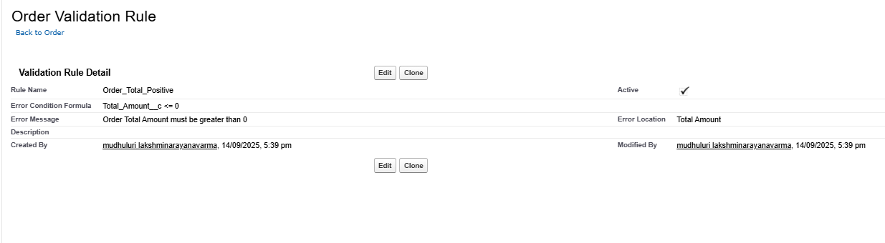
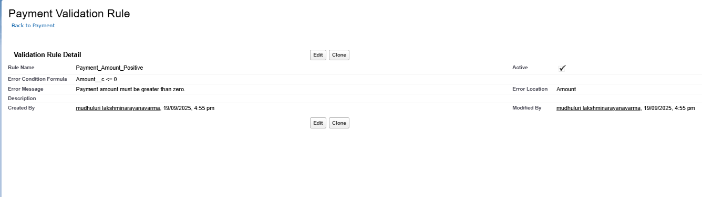
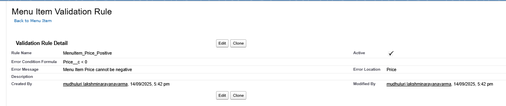
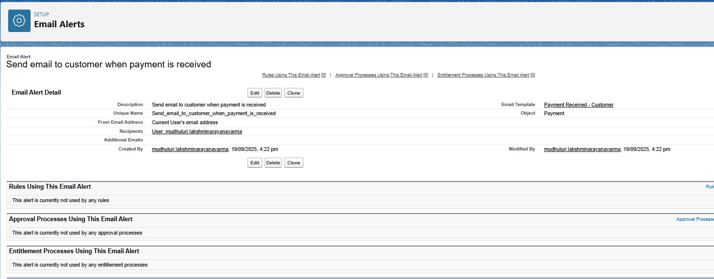
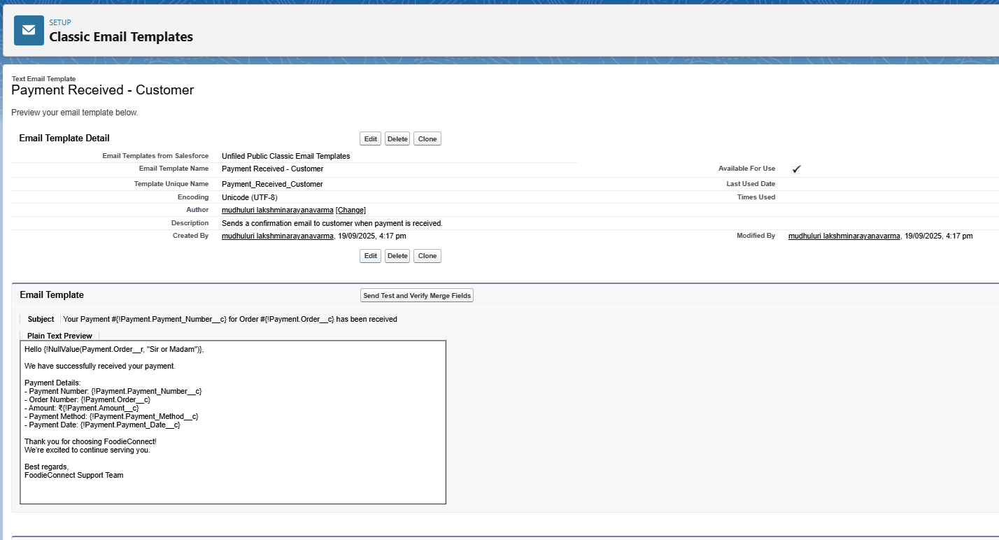
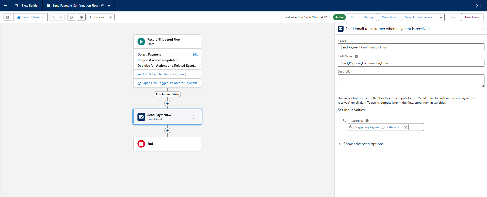
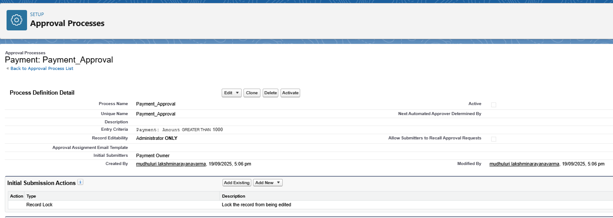
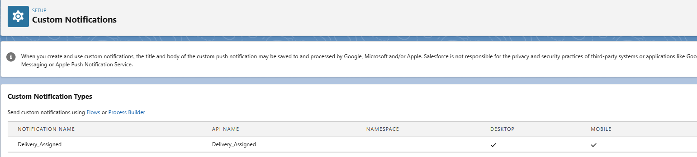

# Salesforce Automation & Configuration Report – FoodieConnect Pvt. Ltd.

##  Validation Rules
**Purpose:** Ensure data integrity by preventing invalid records from being saved.  

**Implemented Rules:**
- **Order_Total_Positive**  
  - **Object:** Order  
  - **Formula:** `Total_Amount__c <= 0`  
  - **Error Message:** "Order Total Amount must be greater than 0."  
  - **Status:** Active ✅  

  
 
  

**Outcome:** Users cannot create Orders with zero or negative amounts, maintaining accurate financial data.  

---

## Email Alerts
**Purpose:** Automatically notify customers when key actions occur.  

**Implemented Alerts:**
- **Payment Received Email Alert**  
  - **Object:** Payment  
  - **Email Template:** `Payment Received - Customer`  
  - **Recipients:** Customer email (configured for testing to owner email)  

  
  

**Outcome:** Customers receive timely confirmation when a payment is received.  

---

##  Flow Builder (Record-Triggered Flows)
**Purpose:** Automate actions based on record changes.  

**Implemented Flows:**
- **Payment Confirmation Flow**  
  - Triggered when a **Payment** record is created.  
  - Automatically sends the **Payment Received Email Alert**.  

  

**Field Updates via Flow:**
- Updating **Order Status** after Payment creation to reduce manual work.  

**Outcome:** Automation is live; emails and record updates occur without manual intervention.  

---

##  Approval Process
**Purpose:** Require manager approval for Payments.  

**Implemented Process:**
- **Payment Approval Process**  
  - **Object:** Payment  
  - **Approver:** Operations Manager (automatically assigned)  
  - **Email Notifications:** Sent to approver when a Payment needs approval and to submitter when approved/rejected.  
  - **Submit for Approval Button:** Added to Payment page layout  
  - **Status:** Active ✅  

  

**Outcome:** Payments are automatically routed for approval before processing.  

---

##  Custom Notifications
**Purpose:** Send in-app notifications to Salesforce users.  

**Implemented Notifications:**
- **Delivery_Assigned Notification**  
  - **Object:** Delivery  
  - **Trigger:** Record-Triggered Flow on creation  
  - **Recipient:** Assigned Rider  
  - **Title:** "New Delivery Assigned"  
  - **Body:** "You have a new delivery for Order {!Delivery.Order__r.Order_Number__c}"  
  - **Status:** Active ✅  

  

