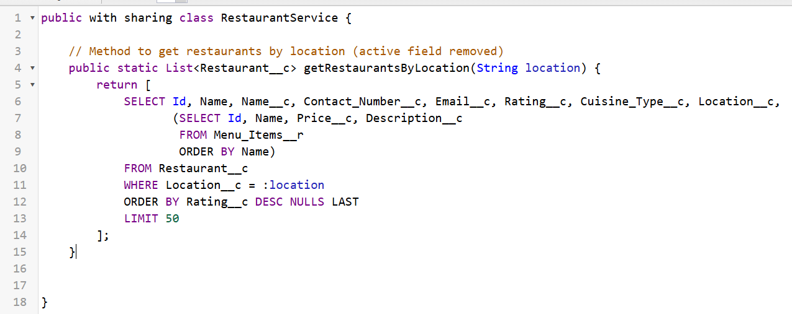
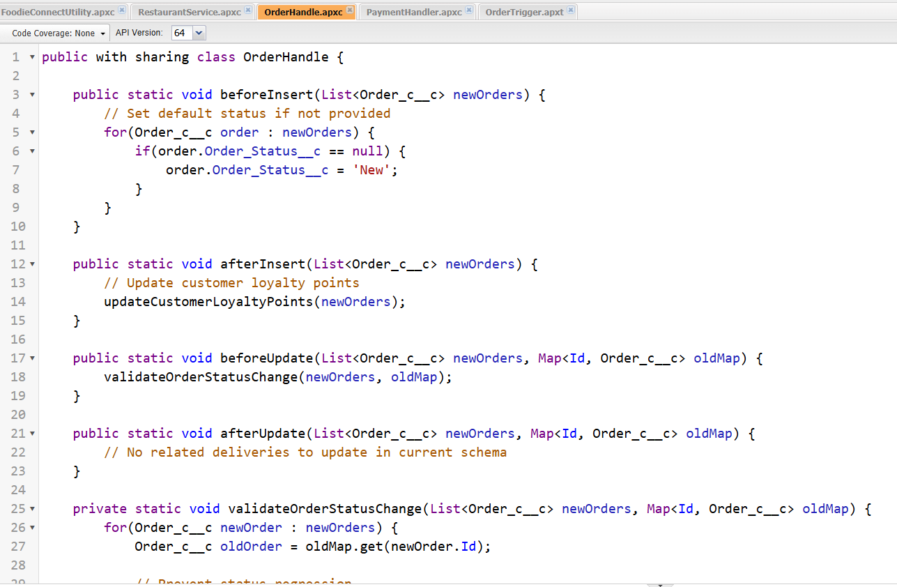
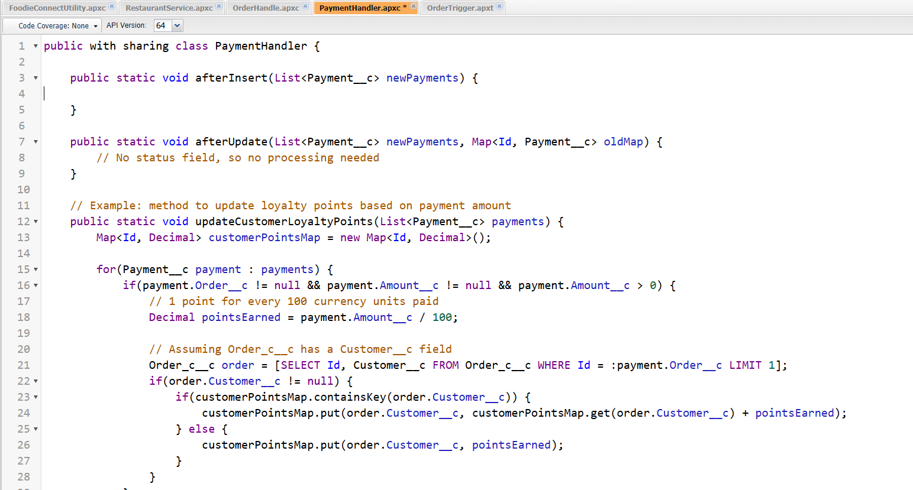
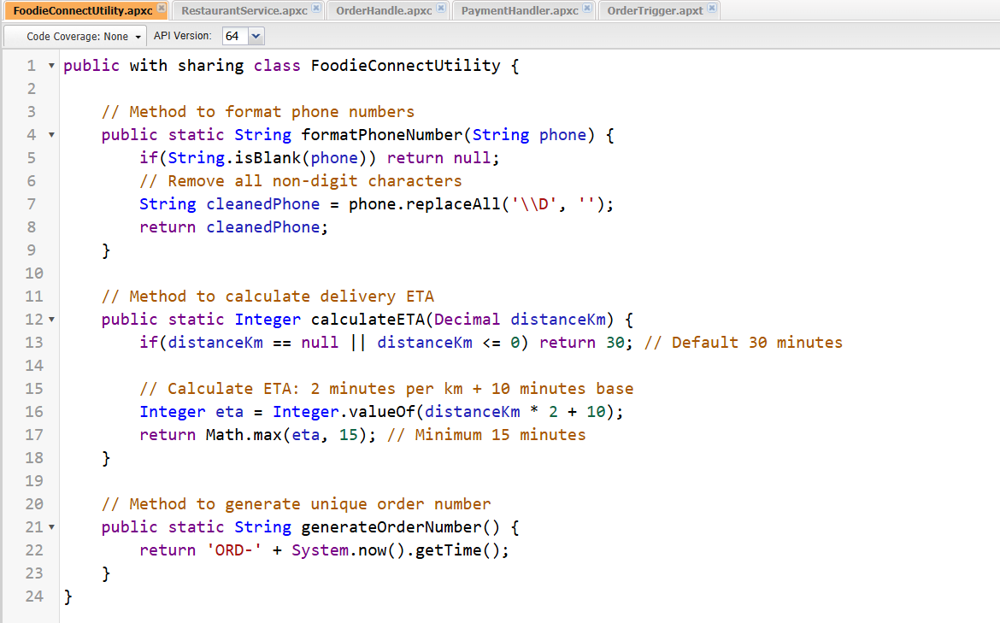
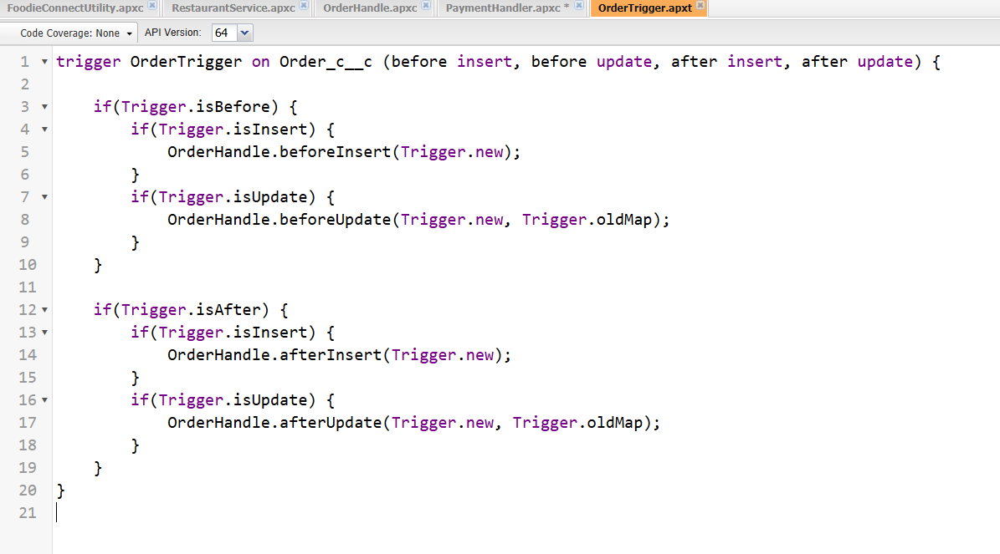
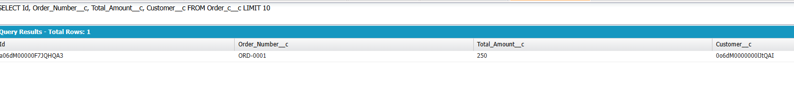
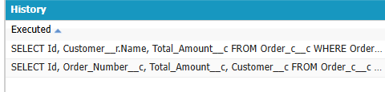
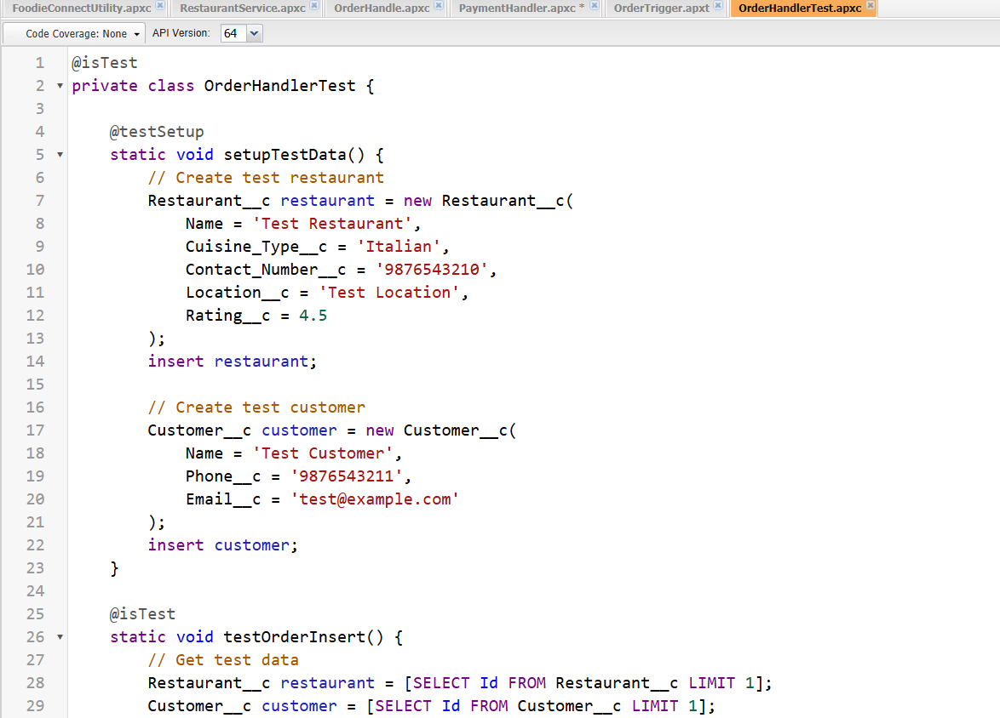
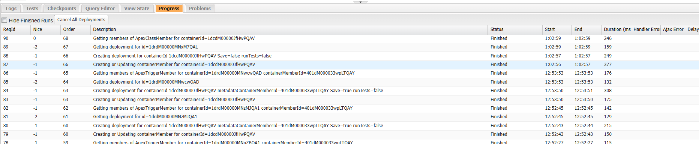

# FoodieConnect Salesforce Project Report

## Project Overview
FoodieConnect Pvt. Ltd. is a Salesforce-powered CRM designed to streamline operations in the food delivery industry. The system automates order management, restaurant information, payments, deliveries, and customer loyalty points.

This report documents the classes, triggers, queries, and test classes implemented in this project.

## Classes & Objects

### RestaurantService
Handles restaurant-related operations such as fetching active restaurants and their menu items based on location.  
**Key Methods:**  
- `getActiveRestaurantsByLocation(String location)` → Fetches active restaurants and their menu items for a specific location  
- `updateRestaurantRating(Set<Id> restaurantIds)` → Updates restaurant ratings based on published reviews  

### OrderHandle
Manages order lifecycle, including auto-generating order numbers, validating order status, creating delivery records, and updating customer loyalty points.  
**Key Methods:**  
- `beforeInsert(List<Order__c> newOrders)` → Sets default status and generates order numbers  
- `afterInsert(List<Order__c> newOrders)` → Creates delivery records and updates loyalty points  
- `beforeUpdate(List<Order__c> newOrders, Map<Id, Order__c> oldMap)` → Validates order status changes  
- `afterUpdate(List<Order__c> newOrders, Map<Id, Order__c> oldMap)` → Updates related deliveries  

### PaymentHandler
Manages payments and integrates payment data with orders. Updates order status after payment creation.  
**Key Methods:**  
- `afterInsert(List<Payment__c> newPayments)` → Updates related orders after payment creation  
- `afterUpdate(List<Payment__c> newPayments, Map<Id, Payment__c> oldMap)` → Handles updates in payment information  

### FoodieConnectUtility
Utility class to generate unique order numbers.

## Apex Triggers

### OrderTrigger
Implements the trigger handler pattern for the `Order__c` object.  
**Trigger Events:**  
- Before Insert → Auto-generates order numbers and sets default status  
- After Insert → Creates delivery records and updates customer loyalty points  
- Before Update → Validates order status changes to prevent invalid transitions  
- After Update → Updates delivery statuses based on order status changes  

## Trigger Design Pattern
All trigger logic is moved into handler classes (`OrderHandle`, `PaymentHandler`) to maintain clean and modular code. Triggers only delegate processing to handlers.

## SOQL Queries
Used SOQL to fetch orders, customers, and restaurant details.  
**Example Queries:**  
SELECT Id, Customer__r.Name, Total_Amount__c
FROM Order__c
WHERE Order_Status__c = 'Confirmed'

SELECT Id, Order_Number__c, Total_Amount__c, Customer__c
FROM Order__c
LIMIT 10

## Collections, Control Statements & Exception Handling

### Collections
- **List** - Used to process multiple records in triggers (`List<Order__c> newOrders`)  
- **Set** - Used for unique ID collections (`Set<Id> restaurantIds`)  
- **Map** - Used to store old records for comparison in updates (`Map<Id, Order__c> oldMap`)

### Control Statements
- If statements - For conditional validations and status checks  
- For loops - To iterate through records and perform bulk operations  
- Switch statements - For handling different order status scenarios

### Exception Handling
- Try-catch blocks - Implemented around DML operations to ensure transaction safety  
- Custom error messages - Added meaningful validation errors for users  
- Error logging - System.debug statements for troubleshooting

## Test Classes

### OrderHandlerTest
Covers unit testing for order insertion, delivery creation, and status validation.  
**Test Cases:**  
- Verify auto-generated order numbers are unique and sequential  
- Confirm delivery records are created for orders with 'Confirmed' status  
- Prevent status regression (e.g., changing 'Delivered' orders back to 'Confirmed')  
- Validate loyalty points are correctly calculated and assigned  
- Test bulk order processing for performance  

**Test Coverage Features:**  
- `@isTest` annotation for test classes and methods  
- `Test.startTest()` and `Test.stopTest()` for governor limit reset  
- `System.assert()` methods for validation  
- Test data factory methods for reusable test data creation  

## Key Features Implemented

### Order Management
- Automated order number generation  
- Status validation and workflow rules  
- Delivery record automation

### Payment Integration
- Real-time payment status updates  
- Order-payment synchronization  
- Failed payment handling

### Restaurant Operations
- Location-based restaurant filtering  
- Dynamic rating calculations  
- Menu item management

### Customer Loyalty
- Points calculation based on order value  
- Automatic points assignment and redemption  
- Loyalty tier management  

## Error Handling & Validation
- Custom validation rules for order status transitions  
- Graceful handling of DML exceptions  
- User-friendly error messages  
- Comprehensive test coverage for edge cases
