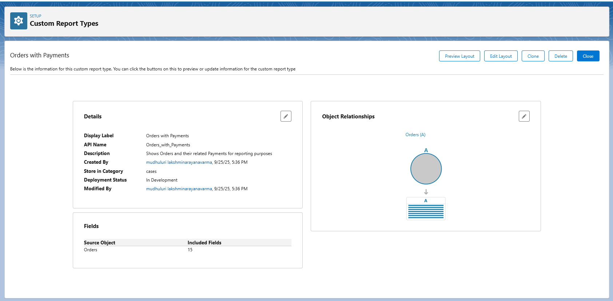
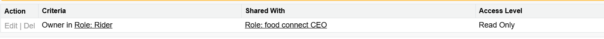
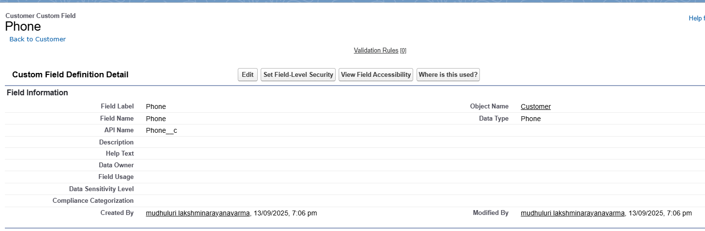
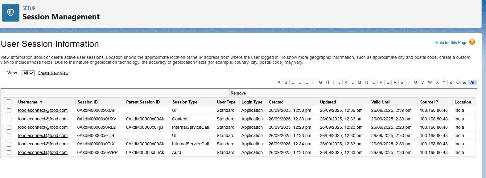
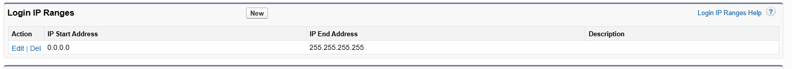
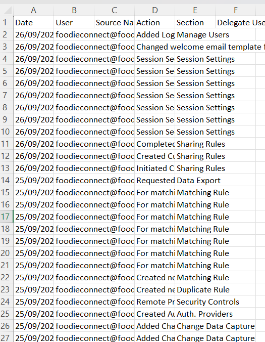

# Salesforce FoodieConnect Restaurant Food Delivery CRM

This documentation describes the Salesforce configuration and reporting setup for FoodieConnect, a restaurant food delivery CRM. The following sections detail reports, dashboards, role-based access controls, and audit configurations implemented.

---

## 1. Reports

- **Tabular Reports:** Simple lists for Customers, Orders, Payments[reports.png].
- **Summary Reports:** Orders grouped by Status, Deliveries grouped by Rider[reports.png].
- **Matrix Reports:** Orders vs Restaurants matrix with total sales[reports.png].
- **Joined Reports:** Combined Customer & Order reports for cross-object insights[reports.png].

_Outcome:_ Management efficiently tracks performance, deliveries, and payments.

---

## 2. Report Types

Custom Report Types were created for advanced cross-object insights:

- Customer with Orders  
- Orders with Payments  
- Delivery with Orders  

_Purpose:_ Enable complex reporting beyond standard Salesforce objects.  
_Status:_ Types deployed and available to all users.

---

## 3. Dashboards

Custom dashboards provide instant KPIs:

- **FoodieConnect Overview:** Orders, Payments, Customer Growth[reports.png].
- **Delivery Performance:** Deliveries by status and rider[reports.png].

_Components:_ Charts, tables, metrics.  
_Outcome:_ Executives and managers get at-a-glance insights.

---

## 4. Dynamic Dashboards

- Displays data specific to the logged-in user’s role.
- Example: Delivery staff see assigned deliveries; Admin views all data.

_Benefit:_ Personalized, role-specific analytics without duplicating dashboards.

---

## 5. Sharing Settings

**Organization-Wide Defaults (OWD):**  
- Customer: Public Read/Write  
- Delivery: Public Read/Write  
- Issue: Public Read/Write  
- Menu Item: Public Read/Write  
- Order: Controlled by Parent  
- Payment: Public Read/Write  
- Restaurant: Public Read/Write  

**Sharing Rules:**  
- Customers → Support Agents (Read/Write)  
- Orders → Managers & Admins (Full Access)  
- Payments → Managers (Full Access)  

_Outcome:_ Proper access and security across user roles.

---

## 6. Field Level Security

- **Admin:** Full field access  
- **Support:** Customer & Issue fields  
- **Riders:** Delivery and Order fields only  
- **Customers:** Own customer record and order history  

_Sensitive fields (Payment info, Loyalty Points) locked down._

---

## 7. Session Settings

- Session Timeout: 2 hours  
- Force logout on timeout: Enabled  
- Lock sessions to domain/IP: Admins only  
- Lightning Web Security: Enabled  
- Multi-Factor Authentication: Admin & Managers (high assurance)

_Benefit:_ Secures logins and prevents unauthorized access.

---

## 8. Login IP Ranges

- **Admins:** Restricted to office IP range (_e.g._, 103.168.80.48)
- **Delivery & Customers:** No IP restrictions (mobile access supported)

_Admin logins protected; other users can access anywhere._

---

## 9. Audit Trail

- Tracks changes across all setup activities:  
  - Object creation (Customer, Order, Payment, Delivery, Issue)  
  - Validation, Sharing, Duplicate Rules  
  - Login IP range updates  
- Audit Trail export available in CSV for reporting.

_Full transparency of config changes and user actions._

